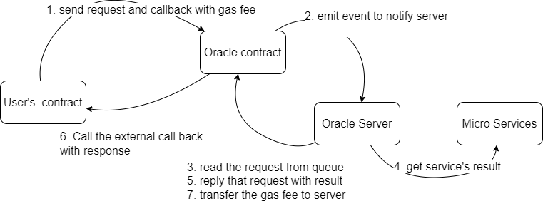

# Simple Oracle Project

This is a Orcacle contract for etherum network. I did this to remind myself that how oracle node works.
There are two ways to update data on oracle contract:

Frontend(\web\oracle-app\src\App.js): Throgh the browser running ethers.js and react to send data to MetaMask.

Nodejs(\server\serverside.js): This script use pure web3.js and private key to signe transaction and send to target blockchain network.

## Installation

Use the package manager [npm](https://www.npmjs.com/) to install packages.

```bash
npm install
cd server 
npm install
cd ../web/oracle-app
npm install
```

## Usage

config the truffle-config.js and run
```bash
truffle compile
truffle deploy
```
Run the react web or the node script

Backend Passive


## What is new ...

Recently I found a new way to write oracle from solidity's [documentation](https://docs.soliditylang.org/en/v0.8.11/types.html?highlight=oracle#function-types) and I decided to implement this method. 



It is using a request queue to hold all requests and the backend server would received an event and do the work according to the request's content. After the server get the result, it will call the external callback function stored in the task queue in oracle smart contract. As the oracle server becomes a event-driven system, I name it Passive Oracle.

The issue from this method is that the oracle will need to pay the gas fee. To handle it, I initially designed a balance system to require user has to top up enough balance for the gas fee, but I fond it vulnerable to the dos attack, so I later changed it. Now it requires user to decide how much the gas fee would be comsumed and attach it to the query.

The code for this server is in this file Nodejs(\server\passiveServer.js): 

Before start, you should change the privateKey and contractAddress. Don't hardcode them, just they to use env variable or build your own api to manage it.

```bash
cd ./server
npm install
npm run passiverServer
```


## Third party api
Chainlink provides a decentrolised solution for oracle reqeust.  I tried an example to get random number on Mumbai test network. To use it on different network, please change the contract addresses and the cost in the constractor.  PS: sufficient amount of LINK coins must be transfered to the user's contract before use it.

I think thye met the same problem while calculate the callback's gas fee, and maybe that is why they need to introdue their own ERC20 token(ERC677 specifically). Also they mentioned that if the callback revert, the contract will be banned.


## License
[MIT](https://choosealicense.com/licenses/mit/)